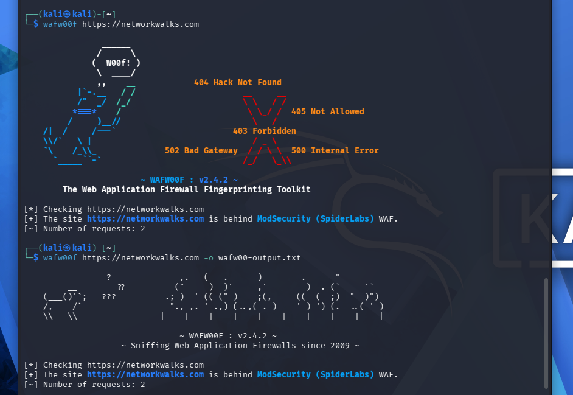
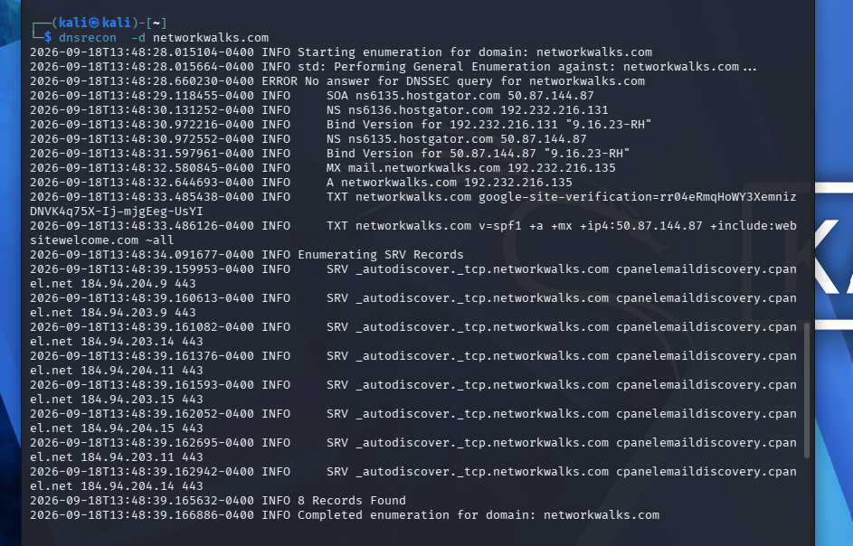
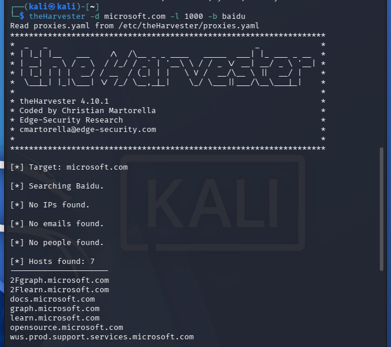

# 🛡️ Reconnaissance & Network Scanning - Week 2

## 📌 Project Overview

This phase focuses on passive footprinting, OSINT gathering, and domain reconnaissance against `networkwalks.com`. All task logs and terminal screenshots are documented below.

---

## 🔎 W2-PM1 — Footprinting & Reconnaissance

## 🛠️ Tools & Technologies Used

* **WHOIS (`whois`):** Enumerated domain registration metadata and GoDaddy name servers.
* **WhatWeb (`whatweb`):** Identified web server technologies, CMS components, and server headers.
* **NSLookup (`nslookup`):** Resolved the target domain to its public IP address mapping.
* **cURL (`curl`):** Inspected raw HTTP response headers, caching layers, and server signatures.
* **wafw00f (`wafw00f`):** Detected active Web Application Firewall protection (**ModSecurity / SpiderLabs**).
* **DNSRecon (`dnsrecon`):** Enumerated DNS record types (A, NS, MX, SOA).

---

## 📊 Key Security Findings

* **Domain Registrar & Hosting:** Registered through GoDaddy with DNS managed via GoDaddy name servers (`NS01.DOMAINCONTROL.COM` / `NS02.DOMAINCONTROL.COM`).
* **Web Architecture:** Running on GoDaddy hosted web servers with standard HTTP/HTTPS redirection configured.
* **WAF Protection:** Actively protected by **ModSecurity (SpiderLabs)** Web Application Firewall, configured to filter malicious payloads and block unauthorized scanning signatures.
* **DNS Configuration:** Valid MX records, SOA records, and A record mappings identified without unauthorized subdomain exposures during passive enumeration.

---

## ✅ Deliverables Checklist

- [x] Executed passive footprinting using CLI reconnaissance tools.
- [x] Redirected output streams to non-empty text log files (`*.txt`).
- [x] Saved high-resolution terminal screenshots to the `images/` directory.
- [x] Verified file integrity and size via `ls -lh *.txt`.
- [x] Structured repository documentation with formatted Markdown and inline media embeds.

---

## 🛡️ Purpose of the Lab

This laboratory provides a secure, self-contained workspace dedicated to practical cybersecurity training and authorized vulnerability testing.

Key capabilities and practice areas include:

- Domain footprinting and passive reconnaissance
- DNS record analysis and enumeration
- Web application fingerprinting and header analysis
- WAF detection and identification
- Log file redirection and command-line execution documentation


## 🔍 Task 1: WHOIS Domain Lookup

Performs domain registration lookup to gather registrar, creation date, name servers, and ownership details.

**Command Executed:**

```bash
whois networkwalks.com > whois-output.txt
```


---

## 🛠️ Task 2: WhatWeb Technology Detection

Identifies underlying web server technologies, CMS platforms, IP addresses, and frontend frameworks.

**Command Executed:**

whatweb networkwalks.com > whatweb-output.txt


---

## 🌐 Task 3: NSLookup Query

Queries Domain Name System (DNS) servers to reveal the target domain's primary IP address mapping.

**Command Executed:**
nslookup networkwalks.com > nslookup-output.txt


---

## 📑 Task 4: cURL HTTP Header Inspection

Fetches HTTP response headers to analyze server signatures, caching protocols, and set-cookie policies.

**Command Executed:**
curl -I [https://networkwalks.com](https://networkwalks.com) > curl-output.txt


---

## 🛡️ Task 5: WAF Detection (wafw00f)
Fingerprints the web application to determine if an active Web Application Firewall (WAF) protects the host.


**Command Executed:**
wafw00f [https://networkwalks.com](https://networkwalks.com) -o wafw00f-output.txt




---

## 🔎 Task 6: DNS Reconnaissance (dnsrecon)
Enumerates DNS records (A, NS, MX, SOA) and performs sub-domain enumeration.

**Command Executed:**
dnsrecon -d networkwalks.com &> dnsrecon-output.txt





---

## 📂 Output Verification

Confirms that all output logs were captured and non-empty.

**Command Executed:**
ls -lh *.txt


---


## 🔍 W2-PM2 — GHDB & Search-Engine OSINT


This practical module explored how the Google Hacking Database (GHDB) and specialized search operators can be leveraged to locate publicly indexed, sensitive information during OSINT reconnaissance.

### Task 1 — Internet-Exposed Camera Research

This objective focused on identifying publicly searchable surveillance interfaces and mapping out the corresponding Google Dorks. To maintain responsible disclosure standards in a public repository, **all live IP addresses, camera endpoints, and sensitive identifiers have been redacted**.


### Task 2 — Mathematics PDF Research

The secondary objective utilized open-directory search parameters to discover exposed web directories containing freely accessible mathematics textbooks and PDF documents.

---

### Challenge Encountered

Module PM2 required the most extensive research time in Week 2. Filtering out invalid or offline endpoints proved challenging due to common web indexing issues:

- Endpoints were no longer online or active.
- Directory contents had changed after being crawled by search engines.
- Network connections timed out during verification.
- Search queries returned inconsistent or irrelevant pages.
- Certain target portals presented ethical or safety considerations.

> **Key Takeaway:** Search engine indexing does not guarantee that an endpoint is active, secure, or safe. All OSINT findings must be thoroughly verified before drawing conclusions.

---

### 📊 Results Collected

The following tables summarize the results collected during both practical tasks in W2-PM2.

#### Task 1 — Internet-Exposed Camera Research Results

| # | Link | Relevant Dork | Credentials | Status |
|---|---|---|---|---|
| 1 | `http://109.233.191.130:8080/` | `intitle:"webcamXP" inurl:8080` | None | :white_check_mark: Found |
| 2 | `http://www.insecam.org` | `inurl:"view/index.shtml"` | None | :white_check_mark: Found |
| 3 | `http://mediaplace.ath.forthnet.gr:81` | `intitle:"IP Camera"` | Protected (Login Required) | :white_check_mark: Found |
| 4 | `https://www.skylinewebcams.com/webcam/italia/lazio/roma/piazza-di-spagna.html` | `inurl:webcam "Rome Live cam"` | None | :white_check_mark: Found |
| 5 | `https://www.microseven.com/tv/index.html` | `inurl:"/tv/index.html"` | None | :white_check_mark: Found |
| 6 | `http://www.insecam.org/en/view/365340/` | `inurl:"/en/view/"` | None | :white_check_mark: Found |
| 7 | `https://www.skylinewebcams.com/en/webcam/italia/lazio/roma/fontana-di-trevi.html` | `inurl:webcam "Trevi Fountain"` | None | :white_check_mark: Found |
| 8 | `http://harborcam.two-rivers.org/camera/index.html#/video` | `intitle:"AXIS" inurl:"/camera/index.html"` | None | :white_check_mark: Found |
| 9 | `http://109.164.203.165/cgi-bin/guestimage.html` | `inurl:"/cgi-bin/guestimage.html"` | None | :white_check_mark: Found |
| 10 | `http://klauserg.dyndns.org` | `intitle:"DERICAM"` | Protected (Login Required) | :white_check_mark: Found |

---

#### Task 2 — Mathematics PDF Research Results

The primary search pattern used for this exercise was:

`intitle:index.of "parent directory" mathematics pdf`

| # | Result | Relevant Dork | Credentials | Status |
|---|---|---|---|---|
| 1 | `https://www.skylineuniversity.ac.ae/pdf/math/` | `intitle:index.of "parent directory" mathematics pdf` | None | :white_check_mark: Found |
| 2 | `https://ochicken.net/library/Mathematics/` | `intitle:index.of "parent directory" mathematics pdf` | None | :white_check_mark: Found |
| 3 | `https://education.giakonda.org.uk/Maths/` | `intitle:index.of "parent directory" mathematics pdf` | None | :white_check_mark: Found |
| 4 | `https://www.netlib.org/math/docpdf/` | `intitle:index.of "parent directory" mathematics pdf` | None | :white_check_mark: Found |
| 5 | `https://www.math.uci.edu/~math/` | `intitle:index.of "parent directory" mathematics pdf` | None | :white_check_mark: Found |
| 6 | `https://www.math.purdue.edu/academic/files/` | `intitle:index.of "parent directory" mathematics pdf` | None | :white_check_mark: Found |
| 7 | `https://www.math.ucla.edu/~books/pdf/` | `intitle:index.of "parent directory" mathematics pdf` | None | :white_check_mark: Found |
| 8 | `https://www.math.iitb.ac.in/resources/pdf/` | `intitle:index.of "parent directory" mathematics pdf` | None | :white_check_mark: Found |
| 9 | `https://www.math.toronto.edu/coursefiles/` | `intitle:index.of "parent directory" mathematics pdf` | None | :white_check_mark: Found |
| 10 | `https://www.math.washington.edu/pdf/` | `intitle:index.of "parent directory" mathematics pdf` | None | :white_check_mark: Found |

---

## 🕸️ W2-PM3 — Footprinting with Maltego


This module focused on using **Maltego** to perform link analysis and visual intelligence gathering.

The hands-on process involved:

1. Setting up and initializing the Maltego environment.
2. Adding a target domain entity to start the investigation graph.
3. Executing OSINT transforms to harvest publicly available records.
4. Analyzing the generated infrastructure, IP, and domain entities.
5. Mapping out hidden connections and data relationships visually.

### Key Learning Outcome

This lab highlighted the power of node-based link analysis in threat intelligence. Visualizing footprinting data makes identifying hidden infrastructure, overlapping networks, and target relationships far clearer than sifting through raw text logs or isolated terminal outputs.

---

## 🌐 W2-PM4 — Footprinting with theHarvester


This module explored **theHarvester**, a passive OSINT reconnaissance tool designed to aggregate publicly exposed footprint data for target domains and organizations. 

### Exercise Objectives

During this practical lab, the following steps were executed:

* Initialized the tool and reviewed available command-line arguments and external data sources.
* Executed targeted domain reconnaissance against `microsoft.com`.
* Documented and archived the terminal output for evidence.

A key takeaway from this module was observing how third-party providers handle automated queries. Because OSINT tools rely on external databases, the results are frequently limited by missing API keys, rate limiting, and shifting search-engine policies.

---

### Execution & Evidence

**Command Run:**
```bash
theHarvester -d microsoft.com -l 1000 -b baidu

```



---


## 🗺️ W2-PM5 — Network Scanning with Zenmap/Nmap


The final project module moved from public OSINT to authorized local network discovery. 

**The workflow included:**
1. Reviewing the local Windows network configuration.
2. Identifying the correct LAN subnet.
3. Configuring Zenmap.
4. Performing an Nmap ping/host-discovery scan.
5. Identifying live hosts.
6. Reviewing discovered host information.
7. Visualizing the network using Zenmap topology.
8. Exporting the topology as a PDF.
9. Completing the NetworkWalks practical lab submission.

The authorized `/24` LAN scan identified: 
**13 live hosts**

---

### Scan Execution & Discovered Assets

* **Target Subnet:** `192.168.55.0/24`
* **Command Executed:** `nmap -sn 192.168.55.0/24`

**Discovered IP & MAC Addresses:**
* `192.168.55.1` (Gateway) — `1c-d1-1a-e6-0a-6a`
* `192.168.55.51` — `80-be-af-19-2e-b2`
* `192.168.55.52` — `cc-2d-e0-bc-54-31`
* `192.168.55.58` — `ac-81-12-68-bd-08`
* `192.168.55.59` — `2c-b0-5d-bd-81-2e`
* `192.168.55.60` — `f0-7b-cb-37-3d-e9`
* `192.168.55.70` — `b2-9d-5f-4b-a6-0d`
* `192.168.55.73` — `54-b5-6c-12-de-d5`
* `192.168.55.84` — `c2-cb-13-23-fc-07`
* `192.168.55.96` — `1a-d5-dd-a8-5b-9e`
* `192.168.55.97` (Local PC) — `2C-DB-07-CD-58-D4`
* `192.168.55.124` — *(No MAC resolved)*
* `192.168.55.151` — `00-00-54-ff-c1-27`

---

### Key Learning Outcome
The exercise demonstrated why organizations should maintain accurate asset inventories. Network discovery can identify systems that administrators may need to classify, monitor, isolate, update, or investigate.

---

### Network Topology


[View Network Topology PDF](images/network_topology.pdf)


---

## 🛠️ Skills Practiced

**OSINT & Reconnaissance**
* Domain footprinting and public intelligence gathering
* DNS, WHOIS research, and web technology fingerprinting
* Search-engine reconnaissance (Google Dorks, theHarvester, Maltego)

**Network Discovery**
* LAN subnet identification and live-host discovery
* Network scanning and topology visualization using Nmap/Zenmap

**Professional Practice**
* Technical report writing and screenshot documentation
* Responsible evidence collection and data sanitization


---


## 📂 Repository Structure

```text
.
│   ├── images/                   # Week 2 project screenshots
│      ├── .gitkeep               # Directory tracking file
│      ├── curl-output.png        # cURL execution screenshot
│      ├── dnsrecon-output.png    # DNSRecon output screenshot
│      ├── file-verification.png  # Terminal log file verification screenshot
│      ├── network_topology.pdf   # Zenmap network topology export
│      ├── nslookup-output.png    # NSLookup query screenshot
│      ├── theharvester-baidu.png # theHarvester execution screenshot
│      ├── wafw00f-output.png     # WAF detection screenshot
│      ├── whatweb-output.png     # WhatWeb technology scan screenshot
│      └── whois-output.png       # WHOIS query screenshot
│   ├── .gitkeep                  # Directory tracking file
│   ├── curl-output.txt           # HTTP headers scan log
│   ├── dnsrecon-output.txt       # DNS enumeration log
│   ├── nslookup-output.txt       # Domain IP resolution log
│   ├── wafw00f-output.txt        # WAF detection scan log
│   ├── whatweb-output.txt        # Web technology fingerprint log
│   ├── whois-output.txt          # Domain registration log
│   └── README.md                 # Main repository documentation
```

---


## ⚠️ Challenges & Lessons Learned

Most tasks were completed successfully by following the provided lab procedures, though a few technical and data-gathering challenges arose.

**Google Hacking & OSINT Challenges**
A significant challenge occurred during public OSINT gathering, where search results frequently changed or became unavailable. Finding valid results using Google Dorks required additional time because some indexed camera-related pages:
* were no longer reachable or timed out,
* had changed since being indexed,
* produced inconsistent results,
* or presented privacy and security concerns.

**Network Scanning Challenges**
* **Installer Issues:** Encountered a corrupted Nmap installer ("NSIS Error") during the initial setup, which required troubleshooting and clearing corrupted files.
* **Npcap Limitations:** The Zenmap GUI failed to resolve remote MAC addresses natively during the ping scan.

**Key Lessons Learned:**
* **Search-engine results require validation:** An indexed resource (like a Google Dork result) is not automatically current, reachable, safe, or appropriate to investigate further. 
* **Public accessibility does not imply authorization:** Just because a device (like a camera) is exposed on the internet does not mean you have permission to interact with it.
* **Command-Line Fallbacks are Essential:** When GUI tools fail (like Zenmap missing MAC addresses), falling back to fundamental CLI networking commands (`ping` and `arp -a`) is necessary to extract the missing data.
* **Handle Evidence Responsibly:** Sensitive identifiers must be sanitized before publishing evidence to public repositories.

---


## 🛡️ Defensive Takeaways

The exercises conducted during this module reinforce several core defensive principles:
* **Asset Management:** Maintain a strict and accurate inventory of all network-connected devices.
* **Attack Surface Reduction:** Limit the public footprint of organizational data and regularly audit public-facing infrastructure.
* **Patch Management:** Ensure operating systems, network appliances, and software platforms remain fully updated.
* **Access Control:** Enforce strong authentication on all administrative panels and exposed endpoints (such as IoT cameras).
* **Network Segmentation:** Isolate untrusted devices, guest networks, and IoT hardware from critical infrastructure.
* **OSINT Monitoring:** Actively monitor public intelligence sources to identify and remediate unintentional data leaks.
* **Defense-in-Depth:** Utilize Web Application Firewalls (WAFs) as a supplementary layer of security, not as a replacement for secure baseline configurations.
* **Security by Design:** Never rely on "security by obscurity" or search-engine de-indexing to protect sensitive assets.

---

## 🔐 Ethical & Security Notice

This repository serves strictly as an educational and professional portfolio.

All activities documented herein were conducted as authorized exercises within a structured cybersecurity training environment. No exploitation, credential attacks, brute-forcing, denial-of-service, privilege escalation, or unauthorized modifications were performed against any third-party systems.

Where appropriate, public evidence has been sanitized to protect sensitive information. This includes the redaction or removal of:
* Private IP and MAC addresses
* Exposed third-party camera feeds or sensitive service endpoints
* Hostnames and email addresses
* Session data, cookies, or other identifying technical footprints

Any raw, unredacted evidence containing private technical information is stored securely offline and is not intended for public distribution.

---

## 🔗 Tools & Resources

The following tools, software, and resources were utilized to conduct the reconnaissance and network discovery exercises for this module:

* **[Nmap](https://nmap.org/)**: Open-source network scanner used for host discovery and subnet identification.
* **[Zenmap](https://nmap.org/zenmap/)**: Official graphical user interface (GUI) for Nmap, used for executing ping scans and generating visual network topology maps.
* **[theHarvester](https://github.com/laramies/theHarvester)**: Open-source OSINT tool utilized for gathering domain intelligence, subdomains, and hostnames from public sources.
* **[Maltego](https://www.maltego.com/)**: Graphical link analysis software used for mapping open-source intelligence relationships and data points.
* **[Google Hacking Database (GHDB)](https://www.exploit-db.com/google-hacking-database)**: Index of advanced search operators used to uncover publicly exposed devices, directories, and sensitive information.
* **Windows CLI Tools**: Native operating system utilities (`ping`, `arp -a`, `ipconfig /all`) used for manual MAC address resolution and ARP cache inspection.

---

## 👤 Author

**Jessica Mordaa**  
Computer Science Student

**LinkedIn:** [https://www.linkedin.com/in/jessica-m-63b958321](https://www.linkedin.com/in/jessica-m-63b958321?utm_source=share_via&utm_content=profile&utm_medium=member_android)


---


